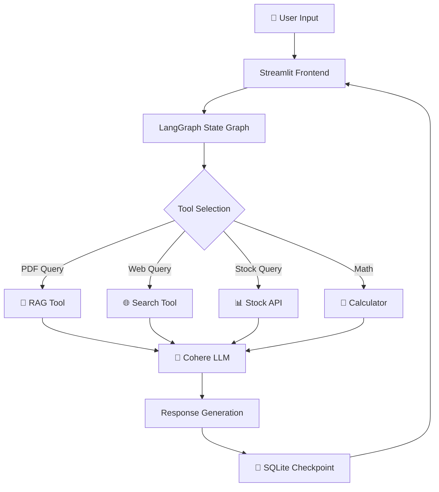

<div align="center">

# 🤖 LangGraph Multi-Utility Chatbot

<p align="center">
  
  
  
  
</p>

```
    ╔═══════════════════════════════════════════════════════════╗
    ║                                                           ║
    ║   📄 PDF Analysis  |  🌐 Web Search  |  📊 Stock Prices  ║
    ║                                                           ║
    ║              🧮 Calculator  |  💬 Multi-Thread Chat       ║
    ║                                                           ║
    ╚═══════════════════════════════════════════════════════════╝
```

**A powerful conversational AI chatbot built with LangGraph, featuring PDF document analysis, web search, stock price lookups, and basic calculations. The chatbot maintains conversation history with thread-based memory and provides an intuitive Streamlit interface.**

[Features](#-features) • [Installation](#-installation) • [Usage](#-usage) • [Demo](#-demo)

</div>

---

## ✨ Features

<table>
<tr>
<td width="50%">

### 📄 PDF Document Analysis
Upload and query PDF documents using RAG (Retrieval Augmented Generation)

### 🌐 Web Search
Real-time web searches using DuckDuckGo

### 📊 Stock Price Lookup
Fetch current stock prices via Alpha Vantage API

</td>
<td width="50%">

### 🧮 Calculator
Perform basic arithmetic operations

### 💾 Thread-Based Conversations
Multiple chat sessions with persistent memory

### ⚡ Streaming Responses
Real-time AI response streaming with tool usage indicators

</td>
</tr>
</table>

## 🏗️ Architecture

<div align="center">



</div>

The application consists of two main components:

### Backend (`langgraph_rag_backend.py`)
- LangGraph state graph implementation
- Tool definitions (RAG, search, calculator, stock price)
- SQLite-based conversation checkpointing
- FAISS vector store for document embeddings
- Cohere LLM integration

### Frontend (`langgraph_rag_frontend.py`)
- Streamlit user interface
- Multi-thread conversation management
- PDF upload and processing
- Real-time streaming chat interface

## Prerequisites

- Python 3.8+
- Cohere API key
- Alpha Vantage API key (for stock prices)

## 📦 Installation

1. Clone the repository:
```bash
git clone https://github.com/bibek373/langgraph-chatbot.git
cd langgraph-chatbot
```

2. Install dependencies:
```bash
pip install -r requirements.txt
```

3. Create a `.env` file in the project root:
```env
COHERE_API_KEY=your_cohere_api_key_here
```

## Dependencies

```txt
langchain
langchain-community
langchain-cohere
langchain-huggingface
langgraph
streamlit
faiss-cpu
pypdf
sentence-transformers
python-dotenv
requests
```

## 🚀 Usage

1. Start the Streamlit application:
```bash
streamlit run langgraph_rag_frontend.py
```

2. The app will open in your default browser at `http://localhost:8501`

3. **Upload a PDF**: Use the sidebar to upload PDF documents for analysis

4. **Start chatting**: Ask questions about your documents or use the built-in tools:
   ```
   💬 "What is the main topic of the uploaded document?"
   🌐 "Search the web for recent AI developments"
   📊 "What's the current price of AAPL stock?"
   🧮 "Calculate 150 multiplied by 3.5"
   ```

5. **Manage conversations**: Create new chat threads or switch between past conversations using the sidebar

---

## 🎬 Demo

<div align="center">

### Chat Interface
*Upload PDFs, ask questions, and get AI-powered responses with tool integration*

### Multi-Thread Management
*Switch between multiple conversation threads seamlessly*

</div>

## 🛠️ Tool Capabilities

<div align="center">

| Tool | Description | Example Query |
|------|-------------|---------------|
| 📄 **RAG Tool** | Retrieves relevant context from uploaded PDFs using FAISS | *"Summarize section 3 of the document"* |
| 🌐 **Web Search** | Performs web searches using DuckDuckGo | *"Latest news about SpaceX"* |
| 📊 **Stock Price** | Fetches real-time stock quotes from Alpha Vantage | *"Current price of TSLA"* |
| 🧮 **Calculator** | Basic arithmetic: add, sub, mul, div | *"What's 456 divided by 12?"* |

</div>

## Configuration

### LLM Model
The default model is Cohere's `command-r-plus-08-2024`. You can modify this in `langgraph_rag_backend.py`:
```python
llm = ChatCohere(model="command-r-plus-08-2024")
```

### Embeddings
Uses `sentence-transformers/all-MiniLM-L6-v2` for document embeddings. Change in `langgraph_rag_backend.py`:
```python
embeddings = HuggingFaceEmbeddings(model_name="your-model-here")
```

### Vector Store Parameters
Adjust chunk size and retrieval parameters:
```python
chunk_size=1000
chunk_overlap=200
search_kwargs={"k": 4}
```

## Data Persistence

- **Conversations**: Stored in `chatbot.db` (SQLite)
- **Documents**: Per-thread FAISS indexes stored in memory
- **Thread Metadata**: Tracked in-memory dictionaries

## 📊 Project Structure

```
langgraph-chatbot/
│
├── 📄 langgraph_rag_backend.py    # Backend logic and graph definition
├── 🎨 langgraph_rag_frontend.py   # Streamlit UI
├── 💾 chatbot.db                   # SQLite database (auto-created)
├── 🔐 .env                         # Environment variables
└── 📖 README.md                    # This file
```

## 🔄 How It Works

```
┌─────────────────────────────────────────────────────────────────┐
│  1️⃣  User Input → Streamlit Interface                          │
│  2️⃣  LangGraph → Processes input through state graph           │
│  3️⃣  LLM → Decides which tools to use                          │
│  4️⃣  Tools → Execute (RAG, search, calculator, stock API)      │
│  5️⃣  LLM → Synthesizes tool outputs into response              │
│  6️⃣  SQLite → Saves conversation state                         │
└─────────────────────────────────────────────────────────────────┘
```

## Limitations

- PDF processing is limited to text-based documents
- Stock price API has rate limits (Alpha Vantage free tier: 25 requests/day)
- Web search uses DuckDuckGo's public API
- Document vectors are stored in memory (not persisted between sessions)

---

## 🤝 Contributing

Contributions are welcome! Please feel free to submit a Pull Request.

<div align="center">

### Made with ❤️ by [bibek373](https://github.com/bibek373)

</div>

## 📜 License

This project is licensed under the MIT License.

## 🙏 Acknowledgments

<div align="center">

| Technology | Purpose |
|------------|---------|
| 🦜 [LangGraph](https://github.com/langchain-ai/langgraph) | Graph-based workflow orchestration |
| 🧠 [Cohere](https://cohere.ai/) | Large Language Model |
| 🎨 [Streamlit](https://streamlit.io/) | User Interface |
| 🔤 [Sentence Transformers](https://www.sbert.net/) | Document Embeddings |
| 🗄️ [FAISS](https://github.com/facebookresearch/faiss) | Vector Search |

</div>

---

<div align="center">

### ⭐ Star this repo if you find it useful!

**[Report Bug](https://github.com/bibek373/langgraph-chatbot/issues)** • **[Request Feature](https://github.com/bibek373/langgraph-chatbot/issues)**

</div>
